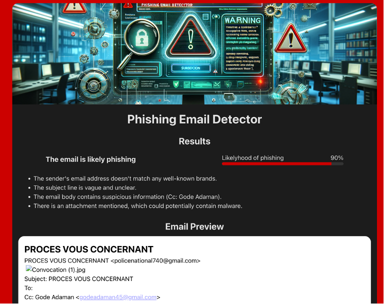

# Phishing Email Detector

A system using a large language model to identify phishing emails and give the user infomative reasons for why emails are or are not flagged as phishing.



## Running It

The system consist of a frontend and a backend, and requires the Ollama-backend to be running with the "llama3"-model installed.

To run the backend go to the `backend` folder, install dependencies with pip and start the dev server:

```sh
cd backend
pip install -r requirements.txt
flask run
```

To run the frontend go to the `frontend` folder, install dependencies with yarn and start the dev server:

```sh
cd frontend
yarn
yarn dev
```
